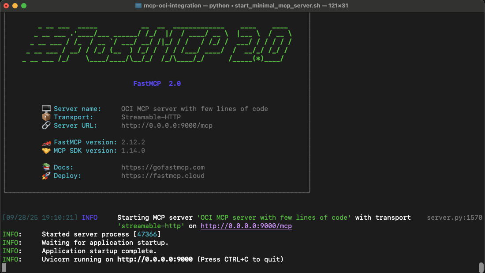

# MCP Oracle OCI integrations
This repository contains code and examples to help in the following tasks:
* **Develop** MCP servers in **Python**
* **Run** MCP servers on **Oracle OCI**
* **Integrate** MCP servers with **AI Agents**
* **Integrate** MCP servers with **OCI resources** (ADB, Select AI, ...)
* **Integrate** MCP Servers running on OCI with AI Assistants like **ChatGPT**, Claude.ai, MS Copilot

## What is MCP?
**MCP (Model Context Protocol)** is an **open-source standard** that lets AI models (e.g. LLMs or agents) connect bidirectionally with external tools, data sources, and services via a unified interface. 

It replaces the “N × M” integration problem (where each AI × data source requires custom code) with one standard protocol. 

MCP supports **dynamic discovery** of available tools and context, enabling 
* AI Assistants to get access to relevant information, available in Enterprise Knowledge base.
* Agents to reason and chain actions across disparate systems. 

It’s quickly gaining traction: major players like OpenAI, Google DeepMind, Oracle are adopting it to make AI systems more composable and interoperable. 

In today’s landscape of agentic AI, MCP is critical because it allows models to act meaningfully in real-world systems rather than remaining isolated black boxes.

## Develop MCP Servers in Python
The easiest way is to use the [FastMCP](https://gofastmcp.com/getting-started/welcome) library.

**Examples**:
* in [Minimal MCP Server](./minimal_mcp_server.py) you'll find a **good, minimal example** of a server exposing two tools, with the option to protect it using JWT.

If you want to start with **something simpler**, have a look at [how to start developing MCP](./how_to_start_mcp.md). It is simpler, with no support for JWT tokens.

## 

